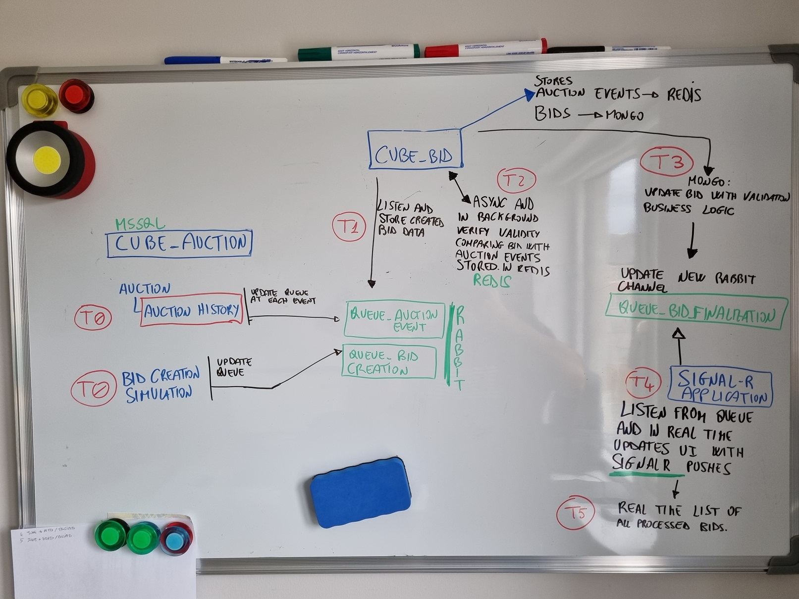

Overall picture



Description high level

### To run locally
1. At the root directory which include **docker-compose.yml** files, run below command run "docker compose up" then ensure to have running containers for 
* mongo
* redis
* orderdb
the above containers must run in background. 

2. set as startup projects "cube_bidsignalr", "cube_bidapi", "cube_auctionapi". Then setup ports

### To run only in containers

1. Clone the repository
2. At the root directory which include **docker-compose.yml** files, run below command:
```csharp
docker-compose -f docker-compose.yml -f docker-compose.override.yml up –d
```
3. You can **launch microservices** as below urls:
* **RabbitMQ -> http://localhost:15672/** guest-guest
* **Web API "cube_bidsignalr" -> http://localhost:9008/**
* **Web API "cube_bidapi" -> http://localhost:8008/swagger/index.html**
* **Web UI "cube_auctionapi" -> http://localhost:8007/swagger/index.html**

4. Detailed description

Goal: create a simple event based POC, testing different storages(mssql, mongo, redis), event based patterns(use of rabbitmq as vehicle), Asp .net core SignalR.
The implemented user scenarios are around bids, the code of the POC is designed to be scalable orizontally